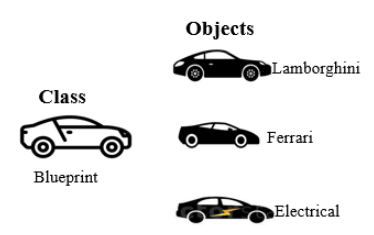
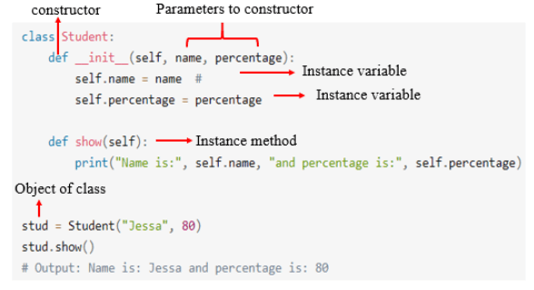
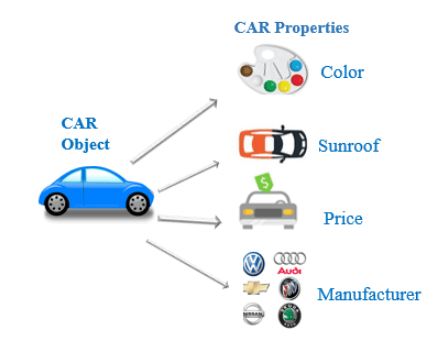

<div id="index"></div>

<sub>[<<Back README index](README.md) | [2. Which method is automatically executed when a class is instantiated? >>](02init.md)</sub>


# 1. What do we use Classes for in Python?

<div style="display: flex; flex-direction: column; justify-content: center; align-items: center;">
    
    <br<>
    <sub>Class-Concepts-Object-Oriented-Programming. By Real Python.com</sub>
</div>
<br>

Table of Contents:

* [1.1  Syntax to define a class in Python](#section1)
* [1.2. Real-Life Example: PersonClass](#section2)
* [1.3. Define the attributes](#section3)
* [1.4. Define the methods](#section4)
* [1.5. Create an object](#section5)
* [1.6. Unique object id](#section6)
* [1.7. Accessing properties and assigning values. Class vs Instance Attributes](#section7)
* [1.8. Class methods](#section8)
* [1.9. Differences between Class Method and Direct Assignment](#section9)
* [1.10. Object Properties](#section10)
* [1.11. Conclusion](#section11)
* [1.12. References](#section12)
* [1.13. Exercises](#section13)


Python is an [object-oriented programming language](https://pynative.com/python/object-oriented-programming/). Almost everything in Python is an object. And **Classes** are essential for creating objects and applying methods on them.  

Classes are object mappers so they essentially give you the ability to create a blueprint for objects. A Class is like an object constructor. Using a class, you can create as many objects as you want.

For example, you are creating a vehicle according to the Vehicle blueprint or plan. The plan contains all dimensions and structure. Based on these descriptions, we can construct a car, truck, bus, or any vehicle. Here, a car, truck, bus are objects of Vehicle class.

<br>


<div style="display: flex; flex-direction: column; justify-content: center; align-items: center;">
    
    <figcaption>Python class and objects. By Pynative.com</figcaption>
</div>

<br>


<br>
<!-- <figure>
    
    <figcaption>Python class and objects. By Pynative.com</figcaption>
</figure>
<br> -->

A class contains the properties (attribute) and action (behavior) of the object. Properties represent variables, and the methods represent actions. Hence class includes both variables and methods. 


Objects created from a class have the same properties and behaviors defined by the class, but can have different values for attributes that are defined in the class.

<br>

<a id="section1"></a>

# 1.1. Syntax to define a class in Python

<sub>[Back to index](#index) | [1.2. Real-Life Example: Person Class>>](#section2)</sub>

<br>
<figure>
    
    <figcaption>Instance variables and methods. By Pynative.com</figcaption>
</figure>

<br>

<br>

To define a class in Python, you use the keyword ``class``, followed by the class name. We use one uppercase letter for the name (that is the common convention) followed by a colon.  For example:
```Python
class ClassName: 
```
It defines a class called ClassName.


Within the class, the variables and methods that characterize it are defined through **indentation**. The general syntax is: 

```Python
class ClassName:
    pass
```

Class definitions cannot be empty, but if you, for some reason, have a class definition with no content (you plan to add more code later), use the **pass** statement to avoid getting an error.


<br>

<a id="section2"></a>

# 1.2. Real-Life Example: PersonClass: 

<sub>[<<1.1. Syntax to define a class in Python](#section1) | [Back to index](#index) | [1.3. Define the attributes>>](#section3)</sub>

Imagine a company creating a blueprint for building cars. Similarly, a class serves as a blueprint for creating objects.
<br>

We define a  class called  `Person` that has attributes(or data members/instance variables) (`name` and `age`) and an instance method (`greet()`).
<br>

Objects (`jessa` and `jon`) are created from this class, each with different states and behaviors. Each object has its own unique memory address (identity).


<br>

```Python
class Person:
    def __init__(self, name, age):
        #data memebers(instance variables)
        self.name = name
        self.age = age

    #Behavior (instance methods)
    def greet(self):
        return f"Hello, my name is {self.name} and I'm {self.age} years old."

# Create two person objects
jessa = Person("Jessa", 30)
jon = Person("Jon", 35)

# Access attributes and methods
print(jessa.greet())  # Output: "Hello, my name is Jessa and I'm 30 years old."
print(jon.greet())    # Output: "Hello, my name is Jon and I'm 35 years old."
```
<br>

<a id="section3"></a>

# 1.3. Define the attributes
<sub>[<<1.2. Real-Life Example: PersonClass](#section2) | [Back to index](#index) | [1.4. Define the methods>>](#section4)</sub>


Attributes are variables inside a class. To define an attribute, use the syntax:<br>

`` self.attribute_name = value``  

In the example of `Person class`, `name` and `age` are attributes.
     
```Python
class Person:
    def __init__(self, name, age):
    #data memebers (instance variables)
    self.name = name
    self.age = age
```
<br>

<a id="section4"></a>

# 1.4. Define the methods
<sub>[<< 1.3. Define the attributes ](#section3) | [Back to index](#index) | [>>1.5. Create an object](#section5)</sub>


Methods are functions inside a class. To define a method, use the syntax:<br>

`def method_name(self, arguments)` 

Methods can modify the object's state.
<br>

For example, the `def greet()` method in the Person class introduces the person.

 ```Python
class Person:
    def __init__(self, name, age):
        self.name = name
        self.age = age

    def greet(self):   #greet method
        return f"Hello, my name is {self.name} and I'm {self.age} years old."


# call methods
print(jessa.greet())  # Output: "Hello, my name is Jessa and I'm 30 years old."
print(jon.greet())    # Output: "Hello, my name is Jon and I'm 35 years old."
```
<br>

<a id="section5"></a>

# 1.5. Create an object
<sub>[<< 1.4. Define the methods ](#section4) | [Back to index](#index) | [>>1.6. Unique Object id](#section6)</sub>
   

We need to perform a process called **instantiation** that is the process of creating an object.

Instantiate the class and store it in a variable that in our example we call it ``jessa`` or ``jon``.

The first thing that happens when you instantiate a class is that it runs the [*\__init__ method*](02metodo.md)  

Whenever you are creating a function inside of a class you need to pass  a default argument (the word `` self`` ) as the first argument.

To **create an object** (instance), for example, from the class called "Person", you use the class name followed by parentheses (), like this:

`` <object-name> = <class-name> (<arguments>)``   

You can create multiple objects from the same class. For example:
 
```Python
# Create two person objects
jessa = Person("Jessa", 30)
jon = Person("Jon", 35)

```
Objects (jessa and jon) are created from this Person class, each with different states and behaviors.

<br>


<a id="section6"></a>

# 1.6. Unique Object id
 <sub>[<< 1.5. Create an object ](#section5) | [Back to index](#index) | [1.7. Accessing properties and assigning values>>](#section7)</sub>
 

The `id()` values for jessa and jon will be different because they are distinct objects with separate memory addresses.

To get an **identity** of an object, you use the `id()` function. It returns its memory address.

For example:
```Python
class Person:
    def __init__(self, name, age):
        self.name = name
        self.age = age

    def greet(self):
        return f"Hello, my name is {self.name} and I'm {self.age} years old."

# Create a person object
jessa = Person("Jessa", 30)

# Get the unique id of the 'jessa' object
jessa_id = id(jessa)

# Print the details
print(f"Name: {jessa.name}")
print(f"Age: {jessa.age}")
print(f"Object ID: {jessa_id}")
```
Output:

```Python
Name: Jessa
Age: 30
Object ID: 1943155787760
```

The id(jessa) call returns a unique integer representing the memory address of the jessa object.
<br>

The jessa_id variable holds this unique identifier.
We print the details, including the object’s name, age, and its unique ID.

Remember, each object has its own distinct identity (memory address), and the id() function helps us explore this uniqueness.

<br>


<a id="section7"></a>

# 1.7. Accessing properties and assigning values. Class vs Instance Attributes

<sub>[<< 1.6. Unique Object id ](#section6) | [Back to index](#index) | [1.8. Class methods>>](#section8)</sub>


<!-- * An instance attribute can be accessed or modified by using the dot notation: 

    * ``instance_name.attribute_name`` 

* A class variable is *accessed* or *modified* using the class name.
    * ``ClassName.variable_name``  -->

**Instance Attributes**:
* An instance attribute (also known as an instance variable) belongs to a specific instance of a class.
* You can access or modify an instance attribute using the dot notation: `instance_name.attribute_name`. In the example of `class Student` below, `s1.name` and `s1.age` are instance attributes representing the name and age of the student instance `s1`.
<br>

**Class Variables (Attributes)**:
* A class variable is shared among all instances of a class.
* It is **accessed** using the class name itself: `ClassName.variable_name`. In the example: 
 `Student.school_name`
* It is **modified** (update the value) by using:
 `classname.class_attribute = value` 
    * In our code example, `school_name` is a class variable shared by all instances of the Student class.
`school_name = 'ABC School'`
    * Changing the value of the class variable will be reflected to all the objects. 
    `Student.school_name = 'XYZ School'`
    

<br>

```
NOTE: when we say “Modify class variable,” we are actually modifying the value of the class variable, not creating a new one. We actually update the class variable value. You update its value globally across all the instances.
```
<br>

For example:
```Python
class Student:
    # class variables
    school_name = 'ABC School'

    # constructor
    def __init__(self, name, age):
        # instance variables
        self.name = name
        self.age = age

s1 = Student("Harry", 12)
# access instance variables
print('Student:', s1.name, s1.age)

# access class variable
print('School name:', Student.school_name)

# Modify instance variables
s1.name = 'Jessa'
s1.age = 14
print('Student:', s1.name, s1.age)

# Update class variable values
Student.school_name = 'XYZ School'
print('School name:', Student.school_name)
```
<br>


<a id="section8"></a>

# 1.8. Class methods
<sub>[<< 1.7. Accessing properties and assigning values](#section7) | [Back to index](#index) | [1.9. Differences between Class Method and Direct Assignment>>](#section9)</sub>


Instance methods work on the instance level (object level). But a class method is bound to the class and not the object of the class. **It can access only class variables**.

For example:

Example: Define and call an *instance* method and *class* method

```Python
# class methods demo
class Student:
    # class variable (shared by all instances)
    school_name = 'ABC School'

    # constructor (instance method)
    def __init__(self, name, age):
        # instance variables
        self.name = name
        self.age = age

    # instance method: Show student details
    def show(self):
        # access instance variables and class variables
        print('Student:', self.name, self.age, Student.school_name)

    # instance method: Change student's age
    def change_age(self, new_age):
        # modify instance variable
        self.age = new_age

    # class method: Modify school name
    @classmethod
    def modify_school_name(cls, new_name):
        # modify class variable
        cls.school_name = new_name

# Create an instance of Student
s1 = Student("Harry", 12)

# call instance methods
s1.show() # Show initial student details
s1.change_age(14) # Change student's age

# call class method
Student.modify_school_name('XYZ School')  # Modify school name
# call instance methods again
s1.show()  # Show updated student details

```
<br>


<a id="section9"></a>

# 1.9. Difference between Class Method and Direct Assignment

<sub>[<<1.8. Class methods](#section8) | [Back to index](#index) | [1.10. Object Properties>>](#section10)</sub>

We have seen two different ways of changing the value of a class variable with class method (section 1.8.above) and direct assignment (section1.9.above). Here are two snipped codes from the mentioned sections:

* Class method:

    ```Python
                     #snipped code from section 1.8.

    # class method: Modify school name
        @classmethod
        def modify_school_name(cls, new_name):
            # modify class variable
            cls.school_name = new_name and this: # Update class variable values

    # call class method
    Student.modify_school_name('XYZ School')  # Modify school name
    ```
* Direct assignment:

    ```Python
                     #snipped code from section 1.7.

    Student.school_name = 'XYZ School'
    ```

 
 Here's a summary of the differences:

* **Class Method**:
    - The first snippet defines a **class method** named `modify_school_name`.
    - Defined using `@classmethod`
    - This method operates on the class level (not instances).
    - Inside the method, `cls` refers to the class itself (similar to `self` for instance methods).
    - In this case, the method modifies the class variable `school_name`.
    - Can be called using the class name (`Student.modify_school_name('XYZ School')`).
    - Typically used for tasks related to the class itself (e.g., modifying class variables).

    * Advantages:
        * *Encapsulation*: Class methods encapsulate the logic related to the class variable within the class itself. This promotes better organization and separation of concerns.
        * *Consistency*: By using a class method, you ensure that any necessary checks or additional actions are consistently applied when modifying the class variable.
        * *Flexibility*: Class methods can perform more complex operations beyond simple assignment. For example, you might validate the new name before updating it.
        * *Maintainability*: If you need to change the behavior of updating the class variable, you only need to modify the class method (not every direct assignment).

    * Use Cases:
        * Use class methods when you want to enforce specific rules or perform additional actions during updates.
        * Useful for maintaining consistency across instances and ensuring proper validation.

2. **Direct Assignment**:
    - The second snippet directly assigns a new value to the class variable (`Student.school_name = 'XYZ School'`)
    - No method involved; directly assigns a new value.
    - Updates the class variable without any special syntax.
    - Simple and straightforward assignment.
    - Useful when you want to change the class variable directly.

    * Advantages: Simplicity, Immediate Effect and Readability.

    * Uses Cases: when you want a simple, immediate update to the class variable.


In summary:

* Direct Assignment: Simple, immediate, and straightforward.
* Class Method: Encapsulates logic, promotes consistency, and allows flexibility.

<br>


<a id="section10"></a>

# 1.10. Object Properties

<sub>[<<1.9. Differences between Class Method and Direct Assignment](#section9) | [Back to index](#index) | [1.11. Conclusion>>](#section11)</sub>


Every object has properties with it. In other words, we can say that object property is an association between **name** and **value**.

For example, a car is an object, and its properties are car color, sunroof, price, manufacture, model, engine, and so on. Here, color is the **name** and red is the **value**. 


<br>


<div style="display: flex; flex-direction: column; justify-content: center; align-items: center;">
    
    <figcaption>Python class and objects. By Pynative.com</figcaption>
</div>

<br>

<br>

Object properties are nothing but **instance variables**.
<br>


# Modify
We can set or modify the object’s properties after object initialization by calling the property directly using the **dot operator**.

``Obj.PROPERTY = value``

Example
```Python
class Fruit:
    def __init__(self, name, color):
        self.name = name
        self.color = color

    def show(self):
        print("Fruit is", self.name, "and Color is", self.color)

# creating object of the class
obj = Fruit("Apple", "red")

# Modifying Object Properties
obj.name = "strawberry"

# calling the instance method using the object obj
obj.show()
# Output Fruit is strawberry and Color is red
```
<br>

# Delete
We can **delete** the object property by using the del keyword. After deleting it, if we try to access it, we will get an error.
```Python
class Fruit:
    def __init__(self, name, color):
        self.name = name
        self.color = color

    def show(self):
        print("Fruit is", self.name, "and Color is", self.color)

# creating object of the class
obj = Fruit("Apple", "red")

# Deleting Object Properties
del obj.name

# Accessing object properties after deleting
print(obj.name)
# Output: AttributeError: 'Fruit' object has no attribute 'name'
```
<br>


<a id="section11"></a>

# 1.11. Conclusion
<sub>[<<1.10. Object Properties](#section10) | [Back to index](#index) | [1.12. References>>](#section12)</sub>


In summary the class definition in Python is a way to organize and structure code, allowing the creation of objects that share similar characteristics and behaviors. 
<br>

Essentially, a class is a template that defines the characteristics and behaviors that objects created from that class will have.


# Importance of classes in Python:
* A class in Python is a type of structure that allows you to organize and reuse code.

* They allow the encapsulation of data and functionality, which facilitates modularity and code reuse.

* They contribute to the organization and structuring of complex programs.

* Defines a set of variables and methods that characterize a type of object.

* Allows the creation of instances or copies of said object.

<br>

<a id="section12"></a>

# 1.12. References
<sub>[<<1.11. Conclusion](#section11) | [<<Back to index](#index)| [1.13. Exercises>>](#section13)</sub>

* [The Python Tutorial » 9. Classes](https://docs.python.org/3/tutorial/classes.html)

* [PYnative.com: Classes and Objects in Python](https://pynative.com/python-classes-and-objects/#h-create-object-of-a-class)

* [W3Schools:Python Classes and Objects](https://www.w3schools.com/python/python_classes.asp9) 

* [HubSpont: Qué son las clases en Python, para qué sirven y cómo funcionan](https://blog.hubspot.es/website/clases-python)

* [Apuntes.de: Programación Orientada a Objetos en Python: Clases, Métodos, Propiedades, etc](https://apuntes.de/python/programacion-orientada-a-objetos-en-python-clases-metodos-propiedades-etc/#gsc.tab=0)

<br>


<a id="section13"></a>

# 1.13. Exercises

* [W3 school: Python classes exercises](https://www.w3schools.com/python/exercise.asp?filename=exercise_classes1)

* [PYnative.com: Exercise: Classes and Objects Exercises](https://pynative.com/python-object-oriented-programming-oop-exercise/)

<br>

[<<Back to README index](README.md)

