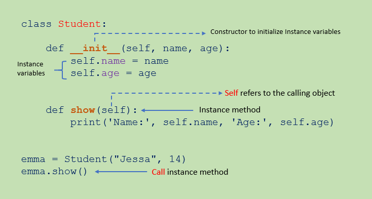
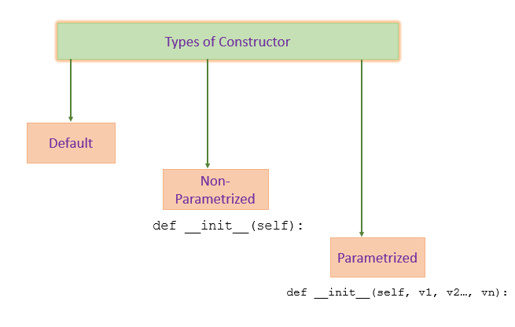

<sub>[<<1. What do we use Classes for in Python?](01class.md) | [Back to README index](README.md) | [3. What are the three API verbs?>>](03verbs.md)</sub>

# 2. Which method is automatically executed when a class is instantiated?

The first thing that happens when you instantiate a class is that it runs the `__init__` **method**.

All classes have a function called `__init__()`, which is always executed when the class is being initiated.

<br>
<figure>
    
    <figcaption>Instance variables and methods. By Pynative.com</figcaption>
</figure>
<br>


# 2.1. What is \__init__ in Python?

In Python, `__init__` is a special method ( [dunder method](08dunder.md) ) known as the constructor. It is automatically called when a new instance (object) of a class is created. The `__init__` method allows you to initialize the attributes (variables) of an object. 
<br>

It is invoked automatically at the time of instance creation for a class. This `__init__` constructor is called as many times as the instances are created for a class.


Here’s an example to illustrate the usage of \__init__ :
```Python
class MyClass:
    def __init__(self, name, age):
        self.name = name
        self.age = age

    def display_info(self):
        print(f"Name: {self.name}")
        print(f"Age: {self.age}")

# Creating an instance of MyClass
obj = MyClass("John", 25)

# Accessing attributes and calling methods
obj.display_info()
```
<br>

<br>

# 2.2. How does \__init__( ) Method Work?

The python \__init__ method is declared within a class and is used to initialize the attributes of an object as soon as the object is formed. 

<br>

A default parameter, named ‘self’ is always passed in its argument. This self represents the object of the class itself. ‘self’ is used as an object variable for assigning values to the data members of an object. 

The \__init__ method is often referred to as double underscores init or dunder init (it has two underscores on each side of its name). They imply that the method is invoked and used internally in Python, without being required to be called explicitly by the object. 

This python \__init__ method may or may not take arguments for object initialisation. You can also *pass* default arguments in its parameter.

<br>


<br>


# 2.3. \__init__ in Python: Syntax


We can declare a \__init__ method inside a class in Python using the following syntax:

```Python
class ClassName():
           
          def __init__(self):
                  # Required initialisation for data members
 
          # Class methods
                 …
                 …
```
<br>

<br>


# 2.4. Types of \__init__ Constructor


<br>
<figure>
    
    <figcaption>Types of constructor By Real Python.com</figcaption>
</figure>
<br>

We can use any of the three types of \__init__ constructors:
- default, 
- parameterised,
- with default parameter  

Let´s see an example with default paraemter:
```Python
class Teacher:
    # definition for init method or constructor with default argument
    def __init__(self, name = "Jordan Hudgens"):
        self.name = name
     # Random member function
    def show(self):
        print(self.name, " is the name of the teacher.")
        
t1 = Teacher()                #name is initialised with the default value of the argument
t2 = Teacher('Mery Smith')    #name is initialised with the passed value of the argument

t1.show()           #Jordan Hudgens is the name of the teacher
t2.show()           #Mary Smith is the name of the teacher
```
<br>

The `self` is a mandatory parameter for any member function of a class, including the \__init__ method, as it is a reference to the object (instance) that´s been created from the class.

The self variable provides a way to make other variables
and objects available everywhere in a class. 
* The self
variable is automatically passed to each method that's
called through an object, which is why you see it listed first
in most method definitions. 
*   Any variable attached to self is available everywhere in the class.

<br>


# Summary
The \__init__() method is a function that's part of a class,
just like any other method. The only special thing about
\__init__() is that it's called automatically every time
you make a new instance from a class. If you accidentally
misspell \__init__(), the method won't be called and your
object may not be created correctly

<br>

# References and further reading


* [mygreatlearning.com: Python \__init__: An Overview](https://www.mygreatlearning.com/blog/python-init/)


* [Python documentation](https://docs.python.org/3/tutorial/classes.html#class-objects)

* [W3schools Python classses ](https://www.w3schools.com/python/gloss_python_class_init.asp)

* [Python Tutorial:Python \__init__ ](https://www.pythontutorial.net/python-oop/python-__init__/)

* [Beginner's Python Cheat Sheet - Classes by E. Matthes](https://ehmatthes.github.io/pcc_3e/cheat_sheets/)

<br>

# Exercises

* [Interview Questions on Python Classes](https://pythongeeks.org/classes-in-python/)

* [Python Object-Oriented Programming (OOP) Exercise: Classes and Objects Exercises](https://pynative.com/python-object-oriented-programming-oop-exercise/)


<br>

[<<Back to README index](README.md)