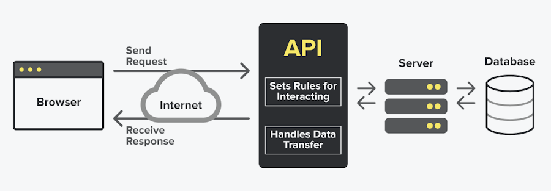
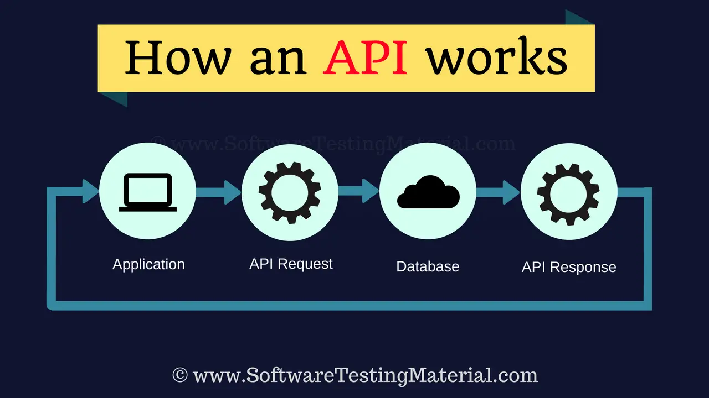

[<< 4. Is MongoDB a SQL or NoSQL database?](04mongodb.md) | [<<Back to README index](README.md)| [6. What is Postman?>>](06postman.md)

# 5. What is an API?
[<<Back to M3C6 Checkpoint index](README.md) | [5.1. Why we use APIs?>>](#51-why-we-use-apis)

 

    
    <br<>
    
[API diagram. By Snipcart](https://snipcart.com/blog/integrating-apis-introduction)

 

Table of Contents:

* [5. What is an API?](#5-what-is-an-api)
* [5.1. Why we use APIs?](#51-why-we-use-apis)
* [5.2. How do APIs work?](#52-how-do-apis-work)
* [5.3. Types of APIs?](#53-types-of-apis)

An API, or application programming interface, is a set of rules or protocols that enables software applications to communicate with each other to exchange data, features and functionality.

 

>APIs allow for the sharing of only the information necessary, keeping other internal system details hidden, which helps with system security. Servers or devices do not have to fully expose data—APIs enable the sharing of small packets of data, relevant to the specific request.

API documentation is like a technical instruction manual that provides details about an API and information for developers on how to work with an API and its services.  Well-designed documentation promotes a better API experience for users and generally makes for more successful APIs.

 
 

# 5.1. Why we use APIs?
[<<5. What is an API?](#5-what-is-an-api) | [<<Back to index](#index) | [5.2. How do APIs work?>>](#52-how-do-apis-work) 

APIs **simplify the design and development** of new applications and services by allowing developers to integrate data, services and capabilities from other applications, instead of developing them from scratch.

One of the main functions of APIs is to make the work of developers easier and **save them time and money**. Because, as mentioned before, you will be able to use parts or functions that others have already created. 

For example, if you are creating an application that is an online store, you will not need to create a payment system. You can use the API of an existing payment service, for example PayPal. 

Or when Uber needed a maps interface to create geolocation-aware depictions of cities and streets. It didn’t build a mapping service - it plugged into Google Maps because Google had ‘exposed’ its API for use by approved external third-party services.

Some other examples of API usage with Social Media Integration: APIs allow you to connect your app or website with social media platforms. For instance:
   - When you open a mobile game and log in using your Facebook account.
   - Posting game results on Twitter directly from the app.
   - Receiving notifications on your mobile or computer from an app 

 
 

    
    <br<>
    
[Source: lukabarami](https://lukabaramishvili.medium.com/restful-api-for-beginners-cde12c8493a7)

 

Another example. Think about all those services that work online with the information in the cloud. To be able to do that, you don't have to set up your own servers, but rather use the APIs of cloud services from companies like Google, Amazon or Microsoft to be able to use theirs.

By allowing different applications to communicate and share data, APIs help create more personalized and user-friendly experiences. For example, a fitness tracking app may use APIs to access and integrate data from various sources like your smartwatch, nutrition apps, and social media platforms.

In summary, APIs are the behind-the-scenes circuits that make applications and websites function, enabling seamless communication between different software components.

 

 

# 5.2. How do APIs work?
[<<5.1. Why we use APIs?](#51-why-we-use-apis) |[<<Back to index](#index) | [5.3. Types of APIs?>>](#53-types-of-apis)

    
    <br<>
   
   [Source: softwaretestingmaterial.com]( https://www.softwaretestingmaterial.com/wp-content/uploads/2018/07/How-An-API-Works.png)

 

 

It’s useful to think about API communication in terms of a request and response between a client and server. The application submitting the request is the client, and the server provides the response. 

The API is the bridge establishing the connection between them.

Here's a simple breakdown of how APIs work:

1. **Protocol for Communication**:
   - Computers follow a set of rules called **protocols** to communicate with each other.
   - For web-based communication, we commonly use the **HTTP protocol** (Hyper Text Transfer Protocol).

2. **Request-Response Cycle**:
   - When a client (requesting computer/device) wants to access data or functionality from a server, it sends an **API request**.
   - The request includes:
     - **URL**: The web address where the request is made.
     - **Method**: Whether the client wants to retrieve existing data or save new data.
   - The server processes the request and sends a **response** back to the client.

 

Let´s see an example of a Third-Party Payment Processing. Imagine a user buying a product on an e-commerce website(Zara). The site offers payment options like “Pay with PayPal.”
 

    
    <br<>
   
API flow between Zara and PayPal. Generated with AI Designer.

 
 

Behind the scenes, this process relies on APIs. Here’s how it works step by step:

* Imagine a user shopping on Zara’s website. When they click the “Checkout” button, an API call is made to retrieve payment information.
* Behind the scenes, Zara’s application communicates with a third-party payment processing API, such as PayPal.
* The Zara´s API sends a request to the external payment system, which responds with the necessary payment details.
* Zara’s application then seamlessly integrates this information, allowing the user to complete their purchase.

 

In summary, APIs facilitate data exchange, automate tasks, and create smooth interactions between different software components. They’re essential for modern applications.

 

 

# 5.3. Types of APIs?
[<<5.2. How do APIs work?](#52-how-do-apis-work) |[<<Back to index](#index)

 

Today, most APIs are `web APIs`. Web APIs are a type of remote API (meaning that the API uses HTTP protocols to manipulate external resources) that expose an application's data and functionality over the internet.

They can be private for a company's use, open only to partners, or public so that any developer can interact with them or create their own APIs to do so. They can also be local APIs for applications that communicate within the same environment or device, or remote APIs for when you have to access a different point.

1. **Open APIs (Public APIs)**:
   - These APIs are publicly available and have no restrictions on access.
   - Developers can freely interact with them to build applications.
   - Example: When you use a smartphone app like **Instagram**, you're interacting with its open API. It allows your phone to communicate with Instagram's servers for actions like scrolling through your feed or posting comments.

2. **Private APIs (Internal APIs)**:
   - These are designed for internal use within a company.
   - They allow different internal teams to communicate and improve products and services.
   - Example: An organization might use an internal API to connect its CRM (Customer Relationship Management) system with its billing system.

3. **Local APIs**:
   - for applications that communicate within the same environment or device.

4. **Remote APIs**:
   - for when you have to access from a different point.

 

CONCLUSION: 
An API (Application Programming Interface) is a set of rules or protocols that allow software applications to communicate with each other, exchange data, features, and functionality. Instead of building everything from scratch, developers can use APIs to integrate data, services, and capabilities from other applications.

 
<figure>
    
    <figcaption>By mannhowie.com</figcaption>
</figure>
 

 

API stands for application programming interface and serves as a bridge for communication between different software applications. Here are the key points:

- **Definition**: An API defines rules and protocols for interaction between programs. It allows applications to communicate without needing to implement complex mechanisms like web scraping.

It establishes how one software module communicates or interacts with another to fulfill one or many functions. 

- **Commands**: APIs provide a set of commands ( [HTTP verbs](03verbs.md) ) that allow your application to communicate with another server or application.

- **Endpoints**: What an API gives you is a set of endpoints. An API exposes specific resources or functionalities through **URL endpoints**. Each endpoint corresponds to a specific action or data retrieval. (So an endpoint is just a URL).

- **Example**: For instance, the URL `https://api.dailysmarty.com/posts` represents an API endpoint that returns data about recent posts. This is going to return `JSON data`, something that an outside application can actually use.

 

Tools like **Postman** (check section about [Postman](06postman.md)) simplify API communication by allowing you to test and manage requests.

We can use Postman in order to streamline how we can communicate with this type of API.

An **API (Application Programming Interface)** is a set of rules and protocols that allows different software applications to communicate with each other. It defines how requests and responses should be structured, enabling seamless interaction between programs. Here are the key components of an API:

1. **URL Endpoint**:
   - The **URL endpoint** represents the specific resource or functionality that you want to access. It's like the address where you knock to get what you need from the API.

2. **[HTTP Verbs](03verbs.md) (REST Verbs)**:
   - APIs use **HTTP verbs** (also known as **REST verbs**) to define the type of operation you want to perform on a resource. These verbs indicate the action you want to take. The most common HTTP verbs in RESTful APIs are:

     - **GET**: Used to retrieve data from the server. When you browse the web, your browser sends GET requests to fetch resources (like web pages) from servers. A successful GET operation returns an OK (200 status code). 
     
     For example, fetching details of a movie from a movie API would involve a GET request.

     - **POST**: Used to create new resources on the server. When you submit a form on a website, it typically sends a POST request to save your data. 
     
     For example, creating a new user account or adding a new item to an online store.

     - **PUT**: Used to update existing resources. If you want to modify an existing record, you send a PUT request. 
     For instance, updating a user's profile information.

     - **DELETE**: Used to remove resources from the server. 
     
     When you delete a file or cancel a subscription, a DELETE request is sent.

3. **Body**:
   - The **body** of an API request contains additional data (such as parameters or payload) needed for the operation. 
   
   For example, when creating a new user, the body might include the user's name, email, and password.

 

In summary, APIs allow applications to talk to each other using well-defined rules, and HTTP verbs play a crucial role in specifying the desired action on resources. Whether you're fetching data, creating, updating, or deleting, these verbs help orchestrate the communication between client and server.

# References
* [A Beginner's Guide to APIs: How to Integrate and Use Them](https://snipcart.com/blog/integrating-apis-introduction)

* [API: qué es y para qué sirve](https://www.xataka.com/basics/api-que-sirve)

* [A Beginner's Guide to APIs: How to Integrate and Use Them](https://snipcart.com/blog/integrating-apis-introduction)

* [IBM: What is an API (application programming interface)?](https://www.ibm.com/topics/api)

* [What is API Integration?](https://www.softwareag.com/en_corporate/resources/api/article/api-integration.html.)

[<<Back to README index](README.md)