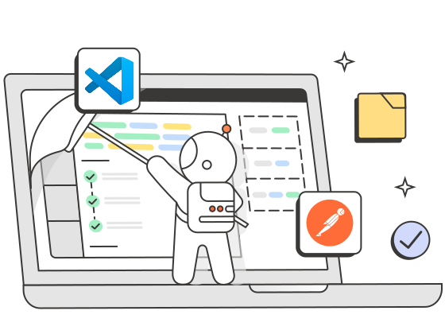

<div id="index"></div>

<sub>[<<5. What is an API?](05API.md) | [<<Back to README index](README.md) | [7. What is polymorphism?](07polymorphism.md)>></sub>

<br>


# 6. What is Postman?
<sub>[<<Back to index](#index) | [6.1. What is Postman Used for?>>](#61-what-is-postman-used-for)</sub>

<br>

<figure>
    
    <figcaption>By Postman</figcaption>
</figure>
<br>

Table of Contents

* [6. What is Postman?](#6-what-is-postman)
* [6.1. What is Postman Used for?](#61-what-is-postman-used-for)
* [6.2. Installing Postman:](#62-installing-postman)
* [6.3. How to use postman?](#63-how-to-use-postman)
* [6.4. Conclusion](#64-conclusion)
* [6.5. References](#65-references)
* [6.6.Exercise](#66-exercise)

<br>

**Postman** is a **software development tool** that allows developers to **test, debug, and document APIs**. 

It has become one of the most popular tools in recent years, due to its ability to simplify the API testing process and its intuitive interface.

Postman is a very helpful application that allows you to communicate with outside APIs.


An API (Application Programming Interface) is a service kind of like a website or server that you can communicate with, but instead of getting a web page back, you get data back. Click here to learn more about [What is an API?](05API.md)

<br>


<br>

# 6.1. What is Postman Used for?
<sub>[<<6.1. What is Postman Used for?](#61-what-is-postman-used-for) | [Back to index](#index) | [6.3. How to use postman?>>](#63-how-to-use-postman)</sub>

Postman is a software application that allows developers to test, document, and share APIs. Developers widely use it to simplify the process of testing APIs by providing a user-friendly interface for making requests, viewing responses, and debugging issues.

APIs provide a structured way for one application to access the capabilities of another application. Typically, this communication happens over the internet by way of an API server. A client application (like a mobile app) sends a request to the server, and after the request is processed the server returns a response to the client.

A request includes the URL of the API endpoint and an HTTP request method. The method indicates the action you want the API to perform. Here are some of the most common methods or [HTTP verbs](03verbs.md):

- GET: Get information
- POST: Add information
- PUT: Replace information
- PATCH: Update some information
- DELETE: Delete information

<br>

For further information about HTTP verbs, visit this section: [What are the three API verbs?](03verbs.md)

<!-- <figure>
    
    <figcaption>Postman is an API platform for building and using APIs. Postman simplifies each step of the API lifecycles. By Postman</figcaption>
</figure>
<br> -->


<div style="display: flex; flex-direction: column; justify-content: center; align-items: center;">
    
    <br<>
    <sub>Postman is an API platform for building and using APIs. Postman simplifies each step of the API lifecycles. By Postman</sub>
</div>


<br>


### Main features
    
- **API Testing**: Allows testing of API collections for both **frontend** and **backend** development.

- **Organization**: Helps organize web services into folders, functionalities, and modules. 

    Postman offers us the possibility of saving and grouping sets of requests in what they call “Collections”, that is, simple folders at different levels that will organize our HTTP requests. And we can have them ready and be able to execute them as many times as necessary.

    
- **API Lifecycle Management**: Supports the entire lifecycle of an API, from conceptualization to maintenance.


- **Documentation Generation**: Can create detailed API documentation.

    Postman generates API documentation automatically, using the information from the requests and the descriptions that you entered when creating them.

    The documentation can be public or private. Furthermore, together with the generated documentation, it shows how API requests should be implemented in different programming languages, something very useful when developing.

- **Environment Management**: Enables working with different environments (e.g., development, production) and sharing information with the development team.

    The use of environment variables helps us perform tests, change between different environments (development environment, testing, production, etc.) and, in general, helps us remember and avoid writing the same text or path repetitively.

<br>


<br>

<br>


# 6.2. Installing Postman:
<sub>[<<6.2. Installing Postman:](#62-installing-postman)| [Back to index](#index) |  [6.3. How to use postman?>>](#63-how-to-use-postman)</sub>

The Postman app is available for Mac, Windows, and Linux operating systems. You can download the app on its [official website](https://www.postman.com/downloads/) by clicking on the system you are working on.  Or, if you prefer a browser experience, you can try the web version of Postman.


I definitely recommend that you sign up it's completely free to use its basic version. It offers some very interesting features:

* Collection synchronization.<br>
* History synchronization.<br>
* Creating links to your Postman collections.

But it also offers some payment options that improve the features, allowing synchronization between members of a team, creation of unlimited mocks, monitoring of environments, etc.
    




```NOTE
NOTE:

Postman VS Code extension Early access!

The Postman VS Code extension, allows you to send API requests from within VS Code—now with support for collections and environments. 
```

<br>

This extension is currently in its beta phase. You can learn more about it here: [ Postman for VSCode](https://marketplace.visualstudio.com/items?itemName=Postman.postman-for-vscode)

Once the file is downloaded we will only have to run it for the installation to begin.

And once the program is open we can see that it is a mix between an IDE (Integrated Development Environment: a software tool that combines code editing, debugging, and build automation features into a single interface), with a panel on the left where you can browse collections and history, and a web browser, with a viewer organized by tabs.


<br>

# 6.3. How to use postman?
<sub>[<<6.2. Installing Postman:](#62-installing-postman) | [Back to index](#index) | [6.4. Conclusion>>](#64-conclusion)</sub>

Let´s see with the aid of an example the steps you have to follow to perform the most typical operations to access an API. We will see a simple `GET` request.


In this example, we’ll keep things simple & use a free and non-authenticated API endpoint. We’ll accomplish this using a free website called [JSON Placeholder](https://jsonplaceholder.typicode.com). It is a free online REST API that you can use whenever you need some fake data. 

In order to create our first request, we’ll just need to enter our API endpoint URL. We’ll use the `users endpoint` (/users	10 users) offered by JSON Placeholder but there are some other samples to try (/posts,/comments, comments, /albums, /photos).


To `make a request` we will:

 1- Click on the address bar located in the right panel that says `Enter request URL`. Here we will write the URL to which we want to make a request.

   https://jsonplaceholder.typicode.com/users
    
2- We will leave the `GET` method checked and
    
3 - Click on the `Send` button. 
    The response provided by the server will be displayed in the lower panel, where we can see the message in detail,  as seen in the following image:


<br>


<br>

<br>

So in the screenshot you’ll notice that we have our JSON response from the API. The mock data offered by this API provides us with a list of 10 different users, along with the data that’s been entered for each user.

4- If you wish, you can save your executions by simply pressing the `Save` button at the top.

Additionally, in the left panel we can create `collections` which will allow us to have a kind of list with all the requests that we have made. It is recommended that we make the collections by API or by the testing categories that we carry out.

5- `Debug` request: If the API response is not as expected, developers can use the Postman debugging tool to identify the problem. This tool displays the API code and `parameters` sent, allowing developers to identify the problem and fix it.

Coming back to ur example, what if we only wanted to get data for one specific user? Well, our test API site supports using query `parameters to filter` our response. Let’s say we want to find information for a user named Delphine. We would append ?username=Delphine to our URL: https://jsonplaceholder.typicode.com/users?username=Delphine

<br>


<br>
<br>

So as we can see above - now our JSON response only contains the data for a single user. If we needed to find a user’s phone number, this could be an easy way to quickly filter our data & get to what we need.

This is really where Postman is great. **We’re able to quickly & visually test out an API call**. We can see what the response data looks like, and understand the structure of requests & responses.

<br>

```Note
TIP:

Use Postman to Generate Python Code

So over in the right-hand side of your Postman window, you’ll see an icon that looks like this: </>

If you click that, you’ll see a dropdown menu of various languages & tools. Select one of those options and Postman will auto-generate code you can use. This auto-generated code will execute the same request you have built in the Postman GUI.
```

<br>

For example, our Postman request we used to get Delphine username, by clicking </>, Postman auto-generates the code (we choose Python) of the request. 


<br>

# 6.4. Conclusion
<sub>[<<6.3. How to use postman?](#63-how-to-use-postman)| [Back to index](#index) | [6.5. References>>](#65-references)</sub>

Postman offers numerous benefits for API developers. These benefits include:

* Simplifying the API testing process.
* Ability to debug and document APIs.
* Load testing tools.
* Intuitive interface for testing and debugging APIs.
* Tools to share requests between teams.

Postman is a tool that is of great help to the development team, allowing you to keep collections updated and saving response times when carrying out tests. 

In summary, it is an awesome tool for developing, monitoring, and testing APIs thanks to its simplicity to carry out the processes.

<br>

# 6.5. References 
<sub>[<<6.4. Conclusion](#64-conclusion) | [Back to index](#index) | [6.6.Exercise>>](#66-exercise)</sub>

You can find some further information here:


[Postman Learning Center: Send your first API request](https://learning.postman.com/docs/getting-started/first-steps/sending-the-first-request/)

[From Postman to Python: Your First GET Request](https://0x2142.com/from-postman-to-python-your-first-get-request/)

[How to Use an API with Postman – A Step-by-Step Guide](https://www.freecodecamp.org/news/how-to-use-an-api-with-postman/#5-how-to-make-your-first-api-request)

[¿Qué es Postman? Explicación de la herramienta de pruebas de API](https://farwebs.es/programacion/que-es-postman/)

[Qué es Postman y primeros pasos](https://openwebinars.net/blog/que-es-postman/)

[lamadriguerabit:¿Qué es Postman?](https://lamadriguerabit.com/articulos/que-es-postman/)


[desarrolloweb.com: Cómo enviar datos en el body con Postman](https://desarrolloweb.com/articulos/como-usar-postman-probar-api)

# 6.6. Exercise
<sub>[<<6.5. References](#65-references) | [<<Back to index](#index)</sub>

You can practice the GET METHOD with this tutorial (two videos) that show you how to use the Unsplash API in a Real Project. The tutorial have two parts:

1.-  [Using the Unsplash API - Tutorial](https://www.youtube.com/watch?v=95wNOAoSyaQ&t=0s).  The tutorial covers fetching high-quality photos from Unsplash for use in your projects or applications.

<br>

2.-  [Using the Unsplash API in a real project](https://www.youtube.com/watch?v=m_KtZDl7J1k). Then the presenter walks you through a quick JavaScript and HTML project demonstrating how to utilize the Unsplash API in a real-world application.


<br>

[<<Back to README index](README.md)


