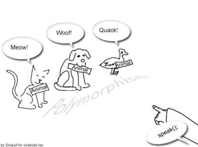

<sub>[<<6. What is Postman?](06postman.md) | [Back to index](00indexm3c6.md) | [8. What is a dunder method?>>](08dunder.md)</sub>

# 7. What is polymorphism?

<sub>[<<6. What is Postman?](06postman.md) | [Back to index](indexM3C6.md) | [8. What is a dunder method?](08dunder.md)>></sub>

Polymorphism in Python is the ability of an object to take many forms. In simple words, polymorphism allows us to perform the same action in many different ways.

As part of polymorphism, a Python child class has methods with the same name as a parent class method. 

<br>


<div style="text-align: center;">
    
</div>


<br>

Simple example of polymorphism using inheritance and method overriding:
```Python
class Animal:
    def speak(self):
        raise NotImplementedError("Subclass must implement this method")

class Dog(Animal):
    def speak(self):
        return "Woof!"

class Cat(Animal):
    def speak(self):
        return "Meow!"

class Duck(Animal):
    def speak(self):
        return "Quack!"

# Create a list of Animal objects
animals = [Dog(), Cat(), Duck()]

# Call the speak method on each object
for animal in animals:
    print(animal.speak())

# Output:
# Woof!
# Meow!
# Quack!
```
<br>

# Creating Custom HTML Tags: A Polymorphic Approach

In this example, we explore how to build custom HTML tags using Python classes. By leveraging inheritance and method overriding, we create flexible and reusable components for rendering HTML content.

Let´s see an example of Using Polymorphism to Build an HTML Generator in Python:

We're going to build out an HTML class so you can think of this as a tool that can render HTML on the page. And then we're going to build multiple subclasses that allow you to render custom versions of that HTML.

We will explore the powerful combination of inheritance and polymorphism. These two concepts often go hand in hand. 

<br>

```Python
class Html:
    def __init__(self, content):
        self.content = content

    def render(self):             
        raise NotImplementedError("Subclass must implement render method")


class Heading(Html):
    def render(self):
        return f'<h1>{self.content}</h1>'


class Div(Html):
    def render(self):
        return f'<div>{self.content}</div>'


tags = [Div('Some content'), Heading('My Amazing Heading'), Div('Another div')]

for tag in tags:
    print(tag.render())

# output:

# <div>Some content</div>
# <h1>My Amazing Heading</h1>
# <div>Another div</div>
```
<br>

In our example above, we have these two classes: `Heading` and `Div` that both are using the same method `render` (in the parent class) and  we've changed their behavior and that's what `polymorphism` does.

```Note:
Polymorphism is when you have a child class that inherits the methods from a parent class and then it overrides the behavior.
```


Our example demonstrates both inheritance and polymorphism in Python. Let’s break it down:

* Inheritance:
    * The Html class serves as the base class (or parent class).
    * The Heading and Div classes are subclasses (or child classes) that `inherit` from the Html class.
    * By inheriting from Html, the Heading and Div classes gain access to the content attribute and the render() method defined in the base class.

* Polymorphism:

    * The render() method is overridden in both the Heading and Div subclasses.
    * Despite having the `same method` name, each subclass provides a `different implementation` of render().
    * When we create instances of Heading and Div and call their render() methods, Python dynamically selects the appropriate implementation based on the object type.


In summary:

* The Heading class overrides the render() method to create an \<h1> HTML tag.
* The Div class overrides the same method to create a \<div> HTML tag.
* The polymorphic behavior allows us to use a common interface (render()) while achieving different results based on the specific subclass.

<br>
<br>

# Building Polymorphic Functions in Python

In the this section we will see a different solution from the same previous example but with the same result. 

We work with polymorphism with Functions and Objects.

We can **create polymorphism with a function that can take any object as a parameter** and execute its method without checking its class type. Using this, we can **call object actions using the same function**  instead of repeating method calls.


We explore the concept of polymorphism by creating custom HTML rendering functions. 

<br>


```Python
class Heading:
    def __init__(self, content):
      self.content = content

    def render(self):
      return f'<h1>{self.content}</h1>'


class Div:
  def __init__(self, content):
    self.content = content

  def render(self):
    return f'<div>{self.content}</div>'

div_one = Div('Some content')
heading = Heading('My Amazing Heading')
div_two = Div('Another div')


# normal function
def html_render(tag_object):
  print(tag_object.render())

html_render(div_one)
html_render(div_two)
html_render(heading)

# output:

# <div>Some content</div>
# <div>Another div</div>
# <h1>My Amazing Heading</h1>
```
<br>

In the above code, we have two classes: Heading and Div. Let’s break down what each class does:

* Heading Class:
    * The Heading class represents an HTML heading element (e.g., \<h1>)
    * It has an \__init__ method that initializes the content attribute.
    * The render method generates an HTML string containing the heading with the specified content.
    * When you create an instance of Heading and call its render method, it produces the appropriate HTML output.

* Div Class:
    * The Div class represents an HTML div element.
    * Similar to the Heading class, it has an \__init__ method to set the content attribute.
    * The render method constructs an HTML string for the div element.
    * When you create an instance of Div and invoke its render method, it generates the corresponding div HTML.

* Usage:
    * In our example, we create instances of both Div and Heading classes (div_one, div_two, and heading).
    **The html_render function accepts a tag object (either a Div or Heading instance) and calls its render method.**
    * The output demonstrates the HTML rendering of the provided content.

<br>

# When to use inheritance or polymorfism in Python?

If you have a lot of shared behavior, then you're probably better off using `inheritance`.
Inheritance is a powerful tool that allows you to create new classes from existing classes.

But if you have a few functions that are very similar, you can use `polymorphism`.
Polymorphism is the ability to use the same function name for different types of objects.

<br>
<br>

# References and further reading

* [DevCamp: Using Polymorphism to Build an HTML Generator in Python](https://basque.devcamp.com/pt-full-stack-development-javascript-python-react/guide/polymorphism-build-html-generator-python)


* [PYnative: Polymorphism in Python](https://pynative.com/python-polymorphism/)

* [Geeksforgeeks: Polymorphism in Python](https://www.geeksforgeeks.org/polymorphism-in-python/)


[<<Back to README index](README.md)